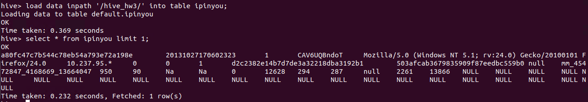

# Hive Custom UDF to parse User Agent
-----------------------

### HIVE

* Hive gives a SQL-like interface to manage data. It is used in Amazon H3 file system. It also support HiveQL. Hive implicitly codeword hiveQL statement into Adirected acyclic graph of mapreduce those the spark jobs.  
* It support Advance features such as indices, partition, buckets, asummetric transactions, custom user defined functions, joins, sampling & many others. Lots of them take a considerable amount of time if implemented manually.  

### Adding Jar to HIVE

  

In the above screenshot, I have added jar to the hive.  

### Create table in hive

  

In the above screenshot, I have created table ipinyou.  

### Load Data into table
 
  
 
In the above screenshot, I have loaded data into table.  
**load data:** load data command  
**Inpath ‘/hive_hw3/’:** path where data is present  
**Into table ipinyou:** table ipinyou to store data  

### Create Temporary function
 
  

In the above screenshot, have created temporary function strip which point to a java function to execute.  

### Output

  
 
In the above screenshot, we can see that output contains os, browser, ua, device information.  

**Created by:**  
**Name: Krishna Kumar Singh**  
**Email: krishnaai265@gmail.com**  
**Phone: +91-9368754996** 
